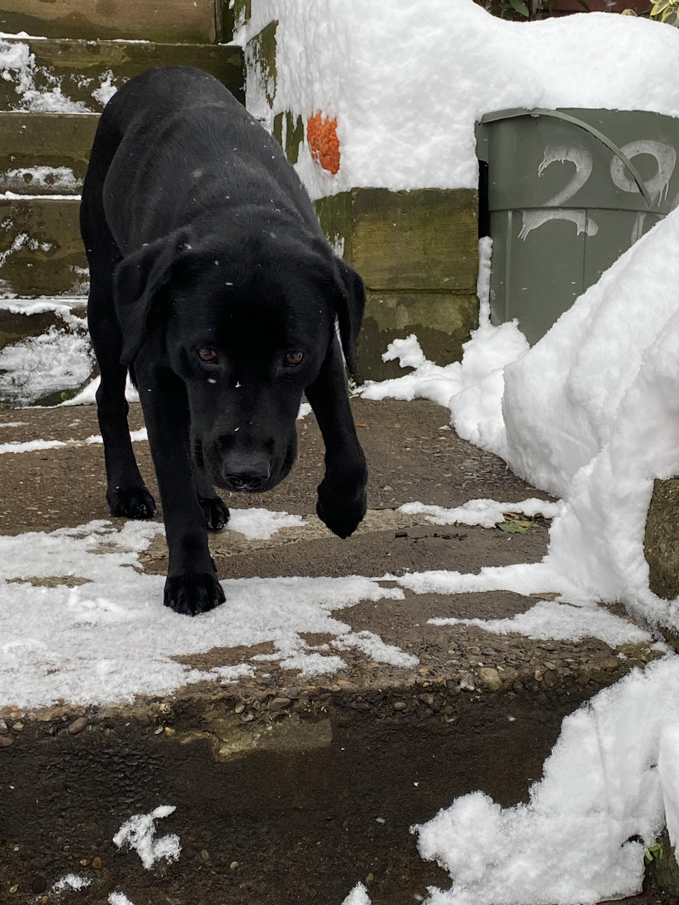

---
---

<link rel="stylesheet" href="styles.css" type="text/css">

<!-- My passion is using data to show how things work whether it be in the realm of predicting, forecasting, descriptive, or visualizations. Data should be used in a way that will show relationships previously unknown or prove relationships that were previously assumed. I am an avid R user and do most of my programming in that language with knowledge of many others. Using docker images that contain solutions using R as a backend environment are fairly new and extremely fun to work on. R has the ability, much like python, to deploy into clusters using [plumber](https://www.rplumber.io/) as a REST API or [shiny](https://shiny.rstudio.com/) as a web application. It is possible to have an entire web application be built in just R(with maybe a little html/js). Besides these, I love time-series and machine learning problems that really challenge how I think about a topic.  -->

I graduated from the University of North Dakota with a B.S. in Math with a minor in Statistics and in B.A. in Economics in 2018; in the near future, I'll be graduating with a M.S. in Economics in 2021 from Carnegie Mellon University. 

Besides spending my weekends learning on my own, I like to watch comedy shows/routines, go on walks with my dog, play chess online, and follow major events.

